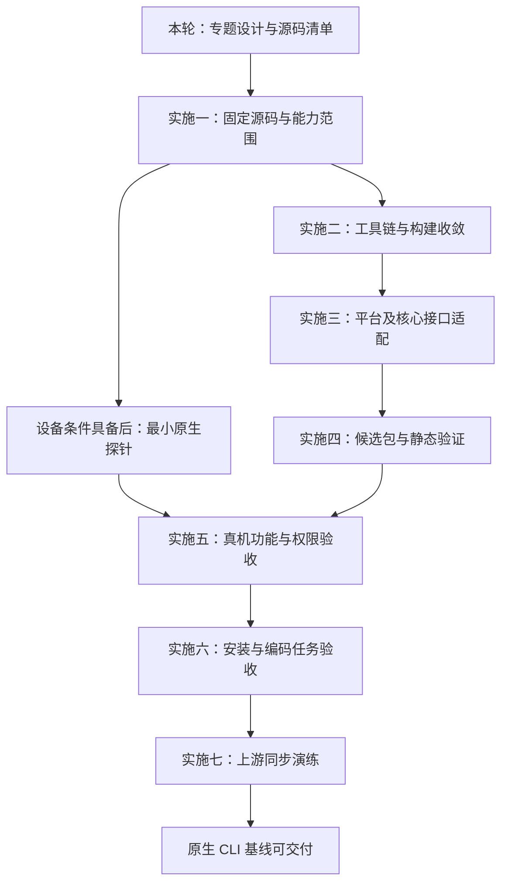

# 实施计划与任务拆分

状态：设计计划已形成，已开始实施一至三中的基线、工具链、进程和凭据工作。签名与真机验收尚未开始，完成情况见[实施进展与构建记录](实施进展与构建记录.md)。下文仍描述完整交付所需的阶段，不能把启动某阶段视为整个阶段已完成。

## 推进原则

用户目前无法直接提供鸿蒙 PC 验证，因此实施采用两条有明确边界的工作线：先推进源码、依赖、交叉构建和候选包；有真实设备条件后补齐签名接受条件、系统能力和完整编码任务验证。没有设备不会阻止文档和源码工作，但不能因此省略最终验收。

首版优先完成原生终端 CLI 与持续合并能力。图形 App 和用户端更新器后续设计；当前需要处理的是不支持能力和错误更新路径的明确行为。

## 阶段与依赖

平台和接口适配会与构建收敛迭代进行。设备若较早可用，立即先验证最小程序和高风险接口，减少基于假设的返工；图中的顺序不要求等所有代码完成后才做设备探针。

## 本轮设计交付

| 内容 | 状态 |
| --- | --- |
| 目标、边界和源码基线 | 已写入文档 |
| 适配工作项及源码入口 | 已按当前基线登记 |
| 各专题的拟议处理和验收条件 | 已形成设计稿 |
| 安装、配置、登录和 codex 启动流程 | 已形成待验证草案 |
| 无设备验证边界和兼容性模板 | 已形成 |
| 实际代码与运行支持 | 已开始小范围源码适配和目标检查；完整运行支持未完成 |

## 实施一：固定基线与首版能力

**输入：** 当前设计集、选择的上游版本。

**任务：** 确认 tag/SHA、Rust 和依赖锁；创建维护工作流；明确首版功能、暂缓特性和默认配置；按[源码清单](适配范围与源码清单.md)复查新增入口。

**对应工作项：** 适配01、适配23、适配24、适配28、适配30。

**产物：** 有真实提交身份的维护记录、功能清单、第一轮依赖和接口风险表。

**通过条件：** 不存在含糊的“最新版”或“全部功能默认兼容”；能力取舍同时覆盖依赖、注册、配置和资源。无需设备即可开始。

## 实施二：工具链与构建收敛

**输入：** 基线及候选 SDK、目标架构。

**任务：** 验证宿主 SDK 工具；配置 Rust 目标、C/C++、sysroot 和链接器；构建最小程序；按实际依赖图解决条件编译与原生依赖；建立目标专用缓存与产物记录。

**对应工作项：** 适配04、适配05、适配16、适配18、适配21、适配22。

**产物：** 可复现构建配置、依赖补丁记录、最小程序和 CLI 候选 ELF，或明确的构建阻断日志。

**通过条件：** 目标编译和链接成功，架构、解释器和动态依赖清单可复核，未混入宿主或普通 Linux 产物。这里只确认构建层级，不宣称能在商业设备运行。

## 实施三：平台和核心接口适配

**输入：** 当前构建错误、SDK 接口证据及专题设计。

**任务：** 处理启动加固、自身路径与辅助入口；实现进程、Shell、PTY 和取消；收敛文件、状态、监听、TLS、认证及 TUI；设计并实现可验证的权限后端。

**对应工作项：** 适配02、适配03、适配06—适配18、适配19、适配20、适配22—适配24。

**产物：** 分层的源码补丁、必要的行为测试、明确的能力结果与缺口。

**通过条件：** 编译路径完整，修改涉及的宿主测试通过，功能不支持时行为明确。没有设备时，系统调用和隔离效果保留“待真机验证”，不使用无权限约束的静默回退填补缺口。

## 实施四：候选包与静态验证

**输入：** CLI、必需辅助程序和最终功能清单。

**任务：** 扩展目标打包；核对资源、许可与摘要；签名；制作完整目录包；修正安装来源及不匹配的更新入口；生成实际包的中文说明。

**对应工作项：** 适配03、适配19、适配21、适配25、适配26、适配27、适配29—适配31。

**产物：** 标有“未真机验证”的候选原生包、构建和签名清单、安装草案。

**通过条件：** 每个启用能力都有完整资源和签名记录，归档解包不损坏内容，不包含个人凭据，不会误选其他平台安装器。到此仍可在没有鸿蒙设备时推进，但不属于最终适配完成。

## 设备探针：条件具备后优先执行

由具备授权设备的执行者按[验证方案](验证方案与兼容性记录.md)记录型号、完整系统、终端及设置。先验证最小签名程序，再验证高风险系统能力。

若目标系统不接受自签名，先核对版本、设置、工具和官方适用条件，再决定是否需要企业二进制证书。若普通用户不能使用候选隔离机制，返回沙箱专题调整设计。不得把开发板、模拟器或 hdc 身份的结果替代最终入口。

## 实施五：真机功能与权限验收

**输入：** 通过基础探针的设备和候选包。

**任务：** 执行[完整验收表](验证方案与兼容性记录.md)，特别验证进程回收、中文终端、凭据刷新、文件锁及权限拒绝；修复实际发现的问题。

**对应工作项：** 所有声明支持的运行能力，重点适配02、适配06—适配18、适配26、适配29。

**产物：** 可复现的设备记录、日志、失败修复与回归结果。

**通过条件：** 成功用例与拒绝用例均符合声明；任何核心能力未验证或失败都不能以“部分能聊天”替代完成。

## 实施六：安装与编码任务验收

**任务：** 在干净用户环境按安装说明配置路径、认证与权限；直接执行 `codex` 完成真实开发任务；检查资源、进程、数据及日志。

**对应工作项：** 适配19、适配25—适配27、适配29—适配31。

**通过条件：** 用户无需构建机目录、调试身份或隐藏依赖，即可在声明支持的鸿蒙 PC 基线上安装并使用。输出正式安装说明和明确的兼容性清单；跨设备支持要有对应证据。

## 实施七：上游同步演练

**任务：** 从已通过的基线合并一个明确的后续上游版本，复查依赖与功能变化，重新构建、签名，并验证数据兼容及编码任务。

**对应工作项：** 适配28 及本次受影响的全部工作项。

**通过条件：** 补丁和合并来源可追溯，新版本仍满足原生使用目标，兼容性变化有记录。完成后再进入用户端应用更新方案设计。

## 风险处理与完成定义

| 风险 | 处理方式 |
| --- | --- |
| SDK 或三方依赖阻止目标构建 | 收敛实际依赖、最小补丁或明确裁剪，保留错误证据 |
| 商业系统 ABI 与候选目标不一致 | 更新工具链或接口实现；不以“编译过了”否认差异 |
| 签名方式不被接受 | 核对具体系统条件，评估官方证书路线 |
| 核心隔离机制不可用 | 评估有依据的原生实现；未解决前保留功能阻断 |
| 暂缓能力成为上游强制依赖 | 重新设计构建和注册，不能只隐藏配置 |
| 长期无真机条件 | 持续维护候选构建与缺口，不声明原生支持已完成 |

实施排期应在首轮目标构建和设备能力结果出现后再估算，不对未知接口工作给出保证日期。最终完成需要：源码适配、原生编码任务、安装配置、权限行为和一次上游同步演练均有证据；全部专题存在，并不等于产品已经适配成功。
