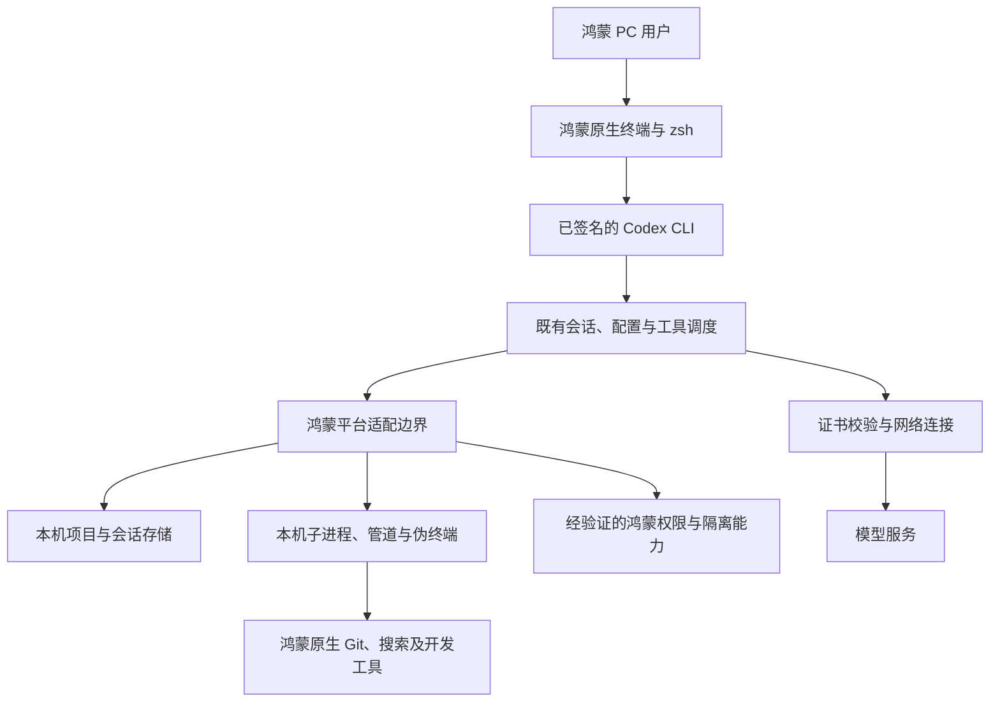

# 鸿蒙电脑原生适配可行性与设计方案

2026-10-04 方案更新：下一轮默认数据在平台提供且验证可用的目录下集中到独立 `codex/`，由 CLI 自动初始化，运行身份不绑定设备 UID。具体目录职责与必要配置的手动准备见[目录布局与维护说明](鸿蒙电脑原生适配/目录布局与维护说明.md)，空白终端、项目权限及正式 HiShell 验收见[通用身份与目录初始化及终端改造计划](鸿蒙电脑原生适配/通用身份与目录初始化及终端改造计划.md)。开发期间取消旧数据迁移代码；编译前关闭模拟器、编译后再开，调试后不需编译则保持运行；安装及所有代码文件用英文名，真机由用户验收。这些改造尚未实施；本文以下保留初始方案及历史示例，不代表当前候选包已经通用适配完成。

状态：源码适配、完整 ARM64 OHOS release 构建、自签名、原生候选包及 Mac 文件安装验证已完成；没有商业鸿蒙 PC，加载、权限和编码任务仍待真机验收。实际版本、能力边界及报告见[实施进展与构建记录](鸿蒙电脑原生适配/实施进展与构建记录.md)。

调研日期：2026 年 10 月 2 日。

源码基线：本仓库提交 `a20fe6335f960a350483d0079db2ec281c68202c`。

文档约定：新增设计文档使用中文文件名和中文正文；代码标识、命令、配置键和既有源码路径保留原名。

推进顺序：先完成可持续维护的鸿蒙 PC 原生 CLI 适配，再设计用户端应用更新方式。持续合并上游 Codex CLI 源码，是适配阶段就要满足的设计要求。

本文保留总体论证。详细工作已拆成中文专题文档，入口为[文档导航](鸿蒙电脑原生适配/文档导航.md)，集中清单位于[适配范围与源码清单](鸿蒙电脑原生适配/适配范围与源码清单.md)。用户操作见[安装配置与运行指南](鸿蒙电脑原生适配/安装配置与运行指南.md)，执行顺序见[实施计划与任务拆分](鸿蒙电脑原生适配/实施计划与任务拆分.md)。

当前没有可直接使用的鸿蒙 PC 验证条件。后续可先推进源码适配、交叉构建和候选包，系统加载及原生功能验收单独保留为待真机任务；详细证据边界见[验证方案与兼容性记录](鸿蒙电脑原生适配/验证方案与兼容性记录.md)。

## 一、结论与目标

**已经在 Mac 上交叉编译并链接得到 ARM64 OHOS 目标的 Codex CLI 开发程序；商业鸿蒙 PC 的原生加载和功能运行仍待验证，不能据此保证所有机型和系统版本都兼容。**

依据有两部分：华为明确提供了鸿蒙电脑运行已签名外部二进制程序的机制；Rust 已有 OHOS 编译目标与交叉编译路径。因此，优先设计“原生终端启动已签名的 Codex 可执行文件”，不需要先重写成 ArkTS 应用。[华为外部扩展程序说明](https://consumer.huawei.com/cn/support/content/zh-cn16079826/)、[Rust OHOS 平台说明](https://doc.rust-lang.org/rustc/platform-support/openharmony.html)

困难主要集中在 Codex 和依赖库对操作系统的假设：进程创建、伪终端、沙箱、凭据存储、动态库、辅助程序和发行打包。**Rust 能生成目标机器码，只解决了移植的一部分。**

本项目的最终目标是：用户在鸿蒙 PC 自带终端输入 `codex`，能够登录、处理本机项目、读取和修改文件、执行鸿蒙本机开发命令，并正常交互、取消任务和恢复会话。

适配对象包括本仓库的 Rust CLI 源码、必要的原生依赖和随包辅助程序。交叉编译与签名属于构建交付流程；源代码中的平台分支、进程、终端、权限及依赖问题仍须逐项解决，并通过鸿蒙 PC 真机上的完整编码任务验收。

明确约束如下：

- 运行设备必须是商业鸿蒙 PC，包括后续选定的笔记本或台式机；手机、平板和 OpenHarmony 开发板不作为验收设备。
- Codex 主进程、文件操作和命令执行都发生在鸿蒙 PC 原生环境。
- 不采用 Linux 子系统、虚拟机、容器、Android 兼容环境或远程 Codex 后端替代原生适配。
- 已从设计阶段进入源码适配阶段；允许在个人 fork 提交和推送，先用苹果电脑推进交叉编译，设备到位后再做运行验收。
- 从第一版开始控制与上游的差异，保留合并后续 Codex CLI 版本的能力；不把当前源码提交永久冻结为独立产品。
- 用户端自动更新、下载渠道、版本切换和应用分发机制，待原生 CLI 适配稳定后另行设计。本阶段保留验证所需的编译、签名和基础安装流程。
- 尚未选定 PC 型号和系统版本；当前构建候选为 ARM64、原生 SDK 6.1.1.125 / API 24，不把构建环境写成已支持的设备规格。
- “原生运行”指客户端及本机工具原生执行；模型请求仍按 Codex 的服务协议访问模型服务，不意味着本地离线推理。

## 二、如何判定真正跑起来

把验收分成三个层级，避免把 `--help` 能显示等同于适配完成。

| 层级 | 必须证明的结果 | 可以得出的结论 |
| --- | --- | --- |
| 原生启动验证 | 签名后的目标二进制由鸿蒙终端直接启动，输出版本和帮助 | 工具链、加载器和基本启动路径可用 |
| 原生编码闭环 | 在鸿蒙本机项目中完成读取、修改、执行命令、展示差异、取消和恢复 | 核心 CLI 功能可用 |
| 可分发版本 | 明确支持矩阵、权限边界、依赖清单、签名和干净环境基础安装结果 | 能交付给其他鸿蒙 PC 用户；应用更新方式另行设计 |

本文设计以第二层为首个功能目标，以第三层为基础交付目标。同时，应通过一次真实上游版本的同步演练，证明适配改动可以随上游继续维护。只有聊天、远程操作其他电脑、只能经调试器启动，都不满足最终目标。

## 三、已经确认的事实和证据边界

### 3.1 鸿蒙 PC 有原生终端和外部程序运行入口

华为的终端使用说明覆盖 HarmonyOS 5.0 及以上，并区分 6.0 以下与 6.0 及以上的开发者模式要求。具体支持的命令应查目标机器终端内的用户手册，不能默认等同于 GNU/Linux。[终端使用说明](https://consumer.huawei.com/cn/support/content/zh-cn16052280/)

华为还说明：在“设置 → 隐私和安全 → 高级”开启“运行外部来源的扩展程序”后，可以运行已签名的外部可执行文件和动态库。这为 CLI 交付提供了原生入口，但不直接证明 Codex 所需的全部系统接口都可用。[外部扩展程序说明](https://consumer.huawei.com/cn/support/content/zh-cn16079826/)

官方环境变量说明中的终端默认 Shell 为 zsh，用户配置文件为 `~/.zshrc`，系统级 `/etc/zshrc` 不供用户修改。适配应验证交互式和非交互式 Shell 实际如何加载环境。[终端环境变量说明](https://consumer.huawei.com/cn/support/content/zh-cn16089085/)

### 3.2 OHOS 编译目标可以作为候选，不能代替商业鸿蒙验证

Rust 官方提供 `aarch64-unknown-linux-ohos` 等目标，以及 SDK Clang、sysroot 和链接器配置方法。这些文档描述的是 OpenHarmony；本方案还需要用所选商业鸿蒙 PC 的 SDK、系统版本、加载器和签名机制验证兼容性。[Rust OHOS 平台说明](https://doc.rust-lang.org/rustc/platform-support/openharmony.html)

特别需要注意：在与本仓库工具链一致的 Rust 1.95.0 中，OHOS 目标基础配置使用 `env: Ohos`，并继承 Linux 基础配置中的 `os: Linux` 和 Unix 家族。因此，候选目标的关键条件是：

```text
目标：aarch64-unknown-linux-ohos
系统条件：target_os = "linux"
环境条件：target_env = "ohos"
家族条件：unix
```

这解释了为什么现有 `#[cfg(target_os = "linux")]` 会选中 OHOS。目标名称中的 `linux` 不代表本方案运行在 Linux 子系统，也不证明目标设备支持所有 Linux 系统调用。[Rust 1.95.0 OHOS 目标源码](https://raw.githubusercontent.com/rust-lang/rust/1.95.0/compiler/rustc_target/src/spec/base/linux_ohos.rs)、[Linux 基础目标源码](https://raw.githubusercontent.com/rust-lang/rust/1.95.0/compiler/rustc_target/src/spec/base/linux.rs)

### 3.3 上游调研基线与当前发布入口

起始提交 `a20fe6335f960a350483d0079db2ec281c68202c` 的源码显示：

- [Rust 工具链配置](../codex-rs/rust-toolchain.toml)固定为 `1.95.0`。
- [CLI 清单](../codex-rs/cli/Cargo.toml)定义包 `codex-cli` 和二进制 `codex`，入口位于 `codex-rs/cli/src/main.rs`。
- [npm 启动器](../codex-cli/bin/codex.js)只映射现有 Linux、macOS、Windows 产物，没有专门的 OHOS 产物映射。
- [打包目标表](../scripts/codex_package/targets.py)和[发布工作流](../.github/workflows/rust-release.yml)没有 OHOS 目标。
- 对 `codex-rs` 中 Rust 源码和 Cargo 清单的检索，未发现明确的 `target_env = "ohos"` 适配分支。

当前已新增 OHOS 打包目标、专用构建签名入口及多个 `target_env = "ohos"` 适配分支；上游在线发布流程与 npm 安装器仍未改成鸿蒙分发渠道。

因此不能把 `npm install -g @openai/codex` 或下载 Linux ARM64 包，写成鸿蒙原生安装步骤。首个交付设计采用独立的已签名原生包，运行核心 CLI 不以安装 Node.js 为前提。

## 四、拟采用的原生架构



尽量复用会话逻辑、协议、补丁处理、配置解析和终端交互。平台差异集中在既有进程、文件、网络、凭据和沙箱模块的边界，不复制一份核心业务逻辑。

如果未来需要图形界面，可以另行评估“鸿蒙原生界面 + 本机 `app-server`”。它仍然依赖本轮的底层适配，不能替代 CLI 原生验证；本轮不设计桌面 App 功能复刻。

## 五、需要适配的具体位置

下表是主要领域概览；包含启动加固、文件监听、MCP 凭据、后台服务和更新入口等补充项的完整工作登记表，见[适配范围与源码清单](鸿蒙电脑原生适配/适配范围与源码清单.md)。

优先级含义：阻断项决定能否启动或完成编码闭环；必要项决定是否可交付；后续项可在明确裁剪的首版中暂缓。

| 领域 | 当前源码证据或假设 | 拟议适配 | 优先级 |
| --- | --- | --- | --- |
| 平台识别 | 多处仅区分 `linux`、`macos`、`windows` | 用 `target_env = "ohos"` 区分候选 OHOS 目标；逐项审核 Linux 专属实现 | 阻断项 |
| 编译与链接 | [工作区依赖](../codex-rs/Cargo.toml)包含 C/C++ 和系统接口依赖 | 固定 SDK、sysroot、目标编译器、链接器与依赖版本，禁止混入宿主库 | 阻断项 |
| 进程创建 | [POSIX 子进程实现](../codex-rs/utils/pty/src/posix_child.rs)存在只覆盖 GNU、musl、macOS 的条件分支 | 补齐 OHOS ABI 分支，验证工作目录、环境、退出码、回收与取消 | 阻断项 |
| 重新执行自身 | [进程辅助模块](../codex-rs/utils/pty/src/spawn_helper.rs)使用 `/proc/self/exe`、`/proc/self/cmdline` | 核查这些路径在目标系统的行为，以及签名校验下的再次启动方式 | 阻断项 |
| 伪终端与信号 | [PTY 模块](../codex-rs/utils/pty/src/pty.rs)、进程组模块依赖 Unix/Linux 行为 | 验证 PTY、终端尺寸、Ctrl+C、进程组终止、子进程不残留 | 阻断项 |
| 沙箱选择 | [沙箱管理器](../codex-rs/sandboxing/src/manager.rs)按 `target_os = "linux"` 选择 Linux 沙箱 | 分离 OHOS 路径；通过能力验证选择实现；没有可用隔离时明确拒绝受限执行 | 阻断项 |
| 沙箱原生依赖 | [bubblewrap 构建脚本](../codex-rs/bwrap/build.rs)在 Linux 条件下编译 C 代码并寻找 `libcap` | 审核 bubblewrap、Landlock、seccomp、namespace 等需求是否可满足，不能默认继承 | 阻断项 |
| Shell 与环境 | [Shell 探测](../codex-rs/shell-command/src/shell_detect.rs)有固定路径和回退顺序；另有定制 zsh 模式 | 发现实际 Shell 路径；验证 `-c`、登录 Shell、环境快照与系统 zsh 的差异 | 阻断项 |
| 文件和状态库 | [状态模块](../codex-rs/state/Cargo.toml)、[路径工具](../codex-rs/utils/path-utils/Cargo.toml) | 验证授权目录、中文路径、软链接、锁、SQLite、原子替换和临时目录 | 阻断项 |
| TLS 与证书 | [HTTP 客户端](../codex-rs/http-client/src/custom_ca.rs)、[加密提供方](../codex-rs/utils/rustls-provider/src/lib.rs) | 验证系统根证书、DNS、HTTPS、流式响应、WebSocket 与 `aws-lc-rs` 等原生依赖 | 阻断项 |
| 登录和凭据 | [登录模块](../codex-rs/login/src/auth/storage.rs)、[凭据依赖](../codex-rs/keyring-store/Cargo.toml) | 首版验证文件凭据；隔离 Linux Secret Service/keyring 依赖；后续评估鸿蒙安全存储 | 必要项 |
| 终端界面 | [TUI 清单](../codex-rs/tui/Cargo.toml)使用 crossterm、ratatui，并含桌面相关依赖 | 验证中文、输入法、粘贴、颜色、鼠标、窗口缩放；审查 D-Bus、剪贴板等集成 | 必要项 |
| 辅助程序 | [打包说明](../scripts/codex_package/README.md)包含 `rg`、代码执行宿主和其他资源 | 所有随包可执行文件及动态库都构建为匹配的鸿蒙产物，并逐一签名 | 必要项 |
| 插件与 MCP | 本地服务可能依赖 Node.js、Python、Shell 或其他二进制 | 把运行时兼容性单独列入支持矩阵；不能把服务协议可用视为所有插件可用 | 后续项 |
| 构建与基础安装 | 现有平台映射与打包目标无 OHOS 条目 | 增加鸿蒙构建、资源定位、校验与签名支持，形成可手动验证的原生包 | 必要项 |
| 上游版本同步 | 平台改动涉及依赖、执行、配置和打包等多个边界 | 控制补丁范围、记录上游基线，每次合并后重新验证鸿蒙能力 | 必要项 |

### 5.1 已发现的具体编译缺口：进程创建

`codex-rs/utils/pty/src/child.rs` 在 Linux 条件下会引入 `posix_child.rs`。后者定义 `addchdir` 时只覆盖：

```text
target_os = "linux" 且 target_env = "gnu"
或者 target_os = "macos" / target_env = "musl"
```

但后面调用 `addchdir` 的代码没有对应的 OHOS 分支。对于 `target_os = "linux"`、`target_env = "ohos"` 的组合，这里形成变量定义缺失。

这是初始设计时由源码推导的问题。实施阶段已增加 OHOS 动态符号发现和兼容回退，完成目标编译链接与定向宿主测试，见[进程交付](鸿蒙电脑原生适配/平台启动与进程首批交付.md)。实际 PTY 行为仍待设备验证；不能只把 OHOS 填进 musl 条件表达式。

### 5.2 沙箱是独立设计问题

需要区分四件事：

1. 二进制签名决定某个程序能否加载和执行。
2. 鸿蒙对终端或应用的授权决定其可以访问哪些系统资源。
3. Codex 审批决定用户是否同意一次工具调用。
4. Codex 沙箱需要约束实际子进程及其后代能读写什么、能否联网。

前三项不能自动证明第四项成立。存在 `sandbox_mode = "read-only"` 配置，也不代表鸿蒙上已经实现了只读隔离。

设计要求：先验证所需系统接口和策略是否可由普通用户进程使用，再决定复用既有隔离机制还是增加鸿蒙实现。若无法提供所请求的隔离，返回清晰的能力不支持错误；不能静默以无沙箱方式执行。

早期网络与界面验证可以使用工程上禁用工具注册的验证构建，但这只是拟议验证方式，不是现有正式参数，也不算原生编码闭环。最终如果无法建立所需权限边界，应明确记录功能阻塞，不转用已排除的运行路线。

### 5.3 非纯 Rust 依赖和功能裁剪

不能只检查 Rust 源码。需对实际依赖图审核 `build.rs`、C/C++ 编译、汇编、预编译库下载和平台符号，重点包括加密库、SQLite、语法高亮相关原生库，以及沙箱依赖。

V8 需要单独处理：

- [代码运行时](../codex-rs/code-mode-runtime/Cargo.toml)使用 V8；[代码执行宿主](../codex-rs/code-mode-host/Cargo.toml)依赖该运行时。
- 既有完整打包流程会构建并携带 `codex-code-mode-host`，不能把单独生成的 `codex` 当成完整发布包。
- [V8 构建说明](../third_party/v8/README.md)列出的产物没有 OHOS 组合。若要保留此能力，需要验证 OHOS 构建、内存映射、可执行内存策略和宿主签名。
- 单独构建 CLI 与构建代码执行宿主是不同范围，不能未经依赖分析就断言所有 CLI 构建必然先被 V8 阻断。

首版建议先验证普通工具调用路径，把代码模式、语音、系统剪贴板、桌面通知等列为可裁剪能力。配置层关闭功能不一定能去除编译依赖；必要时还需调整 Cargo 条件依赖、注册逻辑和打包清单。`--no-default-features` 不是通用修复办法。

## 六、适配边界的设计原则

### 6.1 编译目标和运行能力分开判断

编译阶段识别 OHOS，运行阶段检查具体能力。不能因一个版本有某接口，就承诺其他商业系统版本也可用。

建议记录以下能力结果：原生子进程、管道、PTY、进程组、软链接、自身再次执行、文件锁、证书加载、凭据存储、文件隔离、网络隔离。

平台专有实现可以按以下条件表达，具体变更范围在实施时逐模块确定：

```rust
// 拟议写法，用于说明平台分离；本轮不修改源码。
#[cfg(target_env = "ohos")]
mod harmony;

#[cfg(all(target_os = "linux", not(target_env = "ohos")))]
mod linux;
```

不要批量替换所有 `cfg(unix)` 或 `cfg(target_os = "linux")`；可复用的部分保留，真正依赖特定系统接口的部分分离。能力不足必须在操作前报告。

### 6.2 文件与进程权限形成统一边界

文件工具、补丁工具、Shell 子进程和 MCP 子进程都应服从相同的工作区授权，不能只在界面上检查路径。

原生进程适配的通过标准包括：正确传递参数和环境、识别退出码、及时回收、取消整个进程组、关闭文件描述符；还要检验软链接和路径规范化后的访问边界。

系统可执行文件、自带辅助程序、项目构建产物分别登记来源。**Codex 能启动自己，不代表它随后编译出的测试二进制也能执行。** 测试产物的签名和启动流程应纳入对应开发工具链的设计，不能靠全局关闭系统安全策略解决。

### 6.3 最小能力和后续能力

| 首个编码闭环必须具备 | 可在明确标注后暂缓 |
| --- | --- |
| 原生启动、登录、模型请求、流式输出 | 语音、桌面自动化、系统通知 |
| 读取与修改授权项目、展示差异 | 系统剪贴板图片和复杂终端图像 |
| 原生 Shell 命令、取消、退出和回收 | 依赖尚未移植运行时的插件 |
| TUI 基本输入输出、中文、会话恢复 | 代码模式及 V8 宿主高级能力 |
| 经验证的执行权限边界 | 后续鸿蒙图形界面 |

如果某个暂缓能力被所选模型配置、工具注册或启动流程强制依赖，必须解决依赖或重新定义该阶段产物；不能只隐藏开关。

## 七、上游版本同步与适配维护

### 7.1 当前就要满足的维护目标

鸿蒙适配应长期建立在上游 Codex CLI 的代码和功能演进之上。每次同步的结果是一个经过鸿蒙验证的新源码基线和构建产物；用户端如何发现、下载、安装新版本，留到后续应用更新设计。

本节是项目拟采用的维护约定，不是上游提供的兼容性保证，也不承诺所有新版本都能无修改合并。上游内部接口、依赖、配置和数据格式的变化都要重新审核。

采用以下原则：

- 尽量保留上游目录、模块和接口，优先在既有平台模块内补充鸿蒙实现。
- 将共用修复与鸿蒙专有实现分开提交，避免夹带无关重命名、格式化或整体重构。
- 只抽取确有多处调用的平台接口，不为了本次移植先重写整套平台抽象。
- 新增依赖补丁必须固定来源和提交，记录原因、替代方案及移除条件。
- 新版尚未通过验证时，已验证的维护基线继续保留；合并没有文本冲突不代表行为兼容。

### 7.2 适配改动如何组织

| 改动类别 | 建议落点 | 减少后续合并成本的方法 |
| --- | --- | --- |
| 平台条件和共用兼容性修复 | 既有平台选择、接口边界 | 用最小修改补齐目标组合，保留其他平台的原行为与测试 |
| 鸿蒙专有实现 | 相关模块内的鸿蒙后端 | 把进程、凭据等具体差异集中实现，避免在会话逻辑中散布系统判断 |
| 三方依赖修补 | 明确的依赖覆盖或独立补丁提交 | 固定版本和来源；上游依赖提供等价修复后评估移除 |
| 构建、签名与资源打包 | 目标配置及相关工具脚本 | 使用参数化目标与资源清单，避免复制整套发布脚本 |
| 暂缓能力 | 功能注册与对应打包清单 | 逐项记录限制原因和恢复条件，每次同步检查新增默认功能 |
| 验证和文档 | 既有测试附近及中文维护文档 | 测试平台行为边界，文档跟随实际基线更新 |

按可审核、可独立解释的改动拆分提交；只有需要整体协调的接口变更才合并为同一组。不得通过批量删测试、全局改平台标识或关闭安全校验让新版本表面通过。

维护工作不以上游接收鸿蒙补丁为前提。当前基线的[贡献说明](../docs/contributing.md)明确不接收外部代码贡献和拉取请求，因此默认由本项目维护差异；以后上游有等价实现时，再验证并删除本地补丁。

### 7.3 上游基线和分支约定

当前仓库的 `origin` 指向本项目分支仓库。当前已建立 `codex/harmony-native` 并集成独立会话补丁；尚未执行后续上游版本合并。以下名称用于持续维护：

| 引用或分支 | 职责 |
| --- | --- |
| `upstream` | 指向官方 `openai/codex` 仓库，获取上游版本，不写入鸿蒙改动 |
| 上游版本标签及完整提交号 | 记录每轮实际合并的源码基线；同时保存标签和解析后的提交号 |
| `codex/harmony-native` | 持续维护鸿蒙原生适配，接受通过检查的变更 |
| `codex/harmony-sync-<上游版本>` | 从当前已验证维护基线创建，用于一次版本同步、冲突处理和验证 |

正常同步优先选择明确的正式发布版本，不把浮动开发分支直接当作鸿蒙可用版本。本文的调研提交尚未被认定为一个已验证的发行基线。

共享维护分支采用保留历史的合并流程，便于看清哪些提交来自上游、哪些是鸿蒙补丁。已经用于构建或协作的历史不依靠反复重写来维护；未共享的开发提交可在集成前整理。

必要的上游修复可以单独引入，但必须记录原提交和原因，下一轮完整同步时核对它是否已包含、是否与本地实现重复。

### 7.4 每次上游版本同步流程

1. **选择版本并评估影响。** 核对目标标签和提交；审阅发布说明与两个上游基线间的差异，标记涉及进程、沙箱、认证、终端、配置、依赖和打包的变更。
2. **建立同步候选。** 从已验证的鸿蒙维护基线创建同步分支，合并指定上游提交；保留原基线作为对照。
3. **逐项解决差异。** 按原设计意图处理冲突，审查没有冲突但改变了行为的代码，删除已经被上游等价实现替代的补丁。
4. **同步工具链和依赖。** 一并审核 `rust-toolchain.toml`、Cargo 清单、`Cargo.lock`、构建脚本、原生库和辅助程序。不能遇到冲突就整体保留旧锁文件，也不能只升级依赖而继续使用未经验证的旧工具链。
5. **构建和分层验证。** 先运行受影响模块的检查，再交叉编译鸿蒙产物、重新签名，最后在已声明支持的真机环境验证核心功能。共用代码有变化时，同时验证受影响的既有平台路径。
6. **接纳新基线。** 通过检查后才合入维护分支，并记录对应上游版本、鸿蒙适配提交和验证结果。失败的候选保留问题记录，不标记为已支持版本。

上述流程得到新的鸿蒙 CLI 构建候选，不触发用户设备安装或应用自动更新。

### 7.5 合并后必须重新验证的边界

| 上游变化 | 需要补充的验证 |
| --- | --- |
| 新系统调用或进程接口 | 子进程启动、工作目录、环境、PTY、取消及回收 |
| 沙箱、审批或权限模型变化 | 只读和工作区写入策略、后代进程、越界及联网限制；不允许以放宽策略处理兼容问题 |
| 默认功能或工具注册变化 | 鸿蒙不支持的功能不会因上游默认值变化而重新启用，基础编码路径仍完整 |
| 原生依赖或辅助程序变化 | 目标 ABI、动态依赖、签名清单和实际启动；不混用其他平台二进制 |
| 配置、认证和协议变化 | 旧配置解析、登录及凭据刷新、所需协议版本和错误处理 |
| 会话和数据库格式变化 | 使用测试数据验证旧版本到新版本的迁移，记录旧版本是否还能读取迁移后数据 |

数据迁移使用隔离的测试目录与测试数据，不在真实用户凭据和唯一会话副本上试验。退回旧源码不代表旧程序可以读取新版写过的数据库；这一兼容边界现在就要记录，具体用户端回退方案后续再设计。

建议首个原生编码闭环通过后，选择一个明确的后续上游版本做完整同步演练。有待处理项时区分源码兼容问题、设备限制和暂缓能力，不用“已合并”替代“已验证”。

### 7.6 维护记录与完成条件

实施开始后，可增加中文文件 `适配维护记录.md`，按实际补丁和同步批次记录；目前不生成没有实施结果的空台账。

每个鸿蒙补丁至少记录：影响模块、修改原因、来源提交、关联上游基线、是否仅影响鸿蒙、验证方式以及移除条件。

每次同步至少记录：目标上游标签与完整提交号、鸿蒙适配提交和修订号、Rust/SDK/依赖版本、能力清单、设备与系统版本、产物及签名清单、检查结果和已知问题。保留上游版本语义，鸿蒙修订信息先独立记录，不为未来更新器提前修改所有工作区包版本或设计下载协议。

这一阶段完成的标志是：**已有一个可用的鸿蒙原生 CLI，且至少一次后续上游版本合并经过完整验证，维护人员可以按记录复现。** 之后再讨论应用商店、手动安装包或内置更新等用户端更新方式。

## 八、编译方案：先交叉编译，再考虑本机自举

以下保留初始方案中的手动命令模板，不作为本次实际命令记录。已经执行的自动构建与签名流程见[原生流水线](鸿蒙电脑原生适配/原生资源构建签名与安装流水线.md)。含“绝对路径”“项目路径”的位置必须替换；交叉编译配置要在 SDK 和目标 ABI 验证后才能固定。

### 8.1 构建机与运行机

构建机可以是当前 macOS 工作站，前提是所选 SDK 提供兼容的 Clang 和宿主工具。签名工具也要确认宿主兼容性；必要时在独立构建机完成签名。最终产物仍在鸿蒙 PC 原生运行，构建机的操作系统不改变运行目标。

不把“先在鸿蒙 PC 上安装完整 Rust 工具链并自行编译”作为第一阶段前提。华为资料也说明部分正式系统版本并不预装 Clang，不能把编译工具存在当作默认条件。[鸿蒙电脑编译工具说明](https://consumer.huawei.com/cn/support/content/zh-cn16078461/)

### 8.2 固定构建输入

实施时应记录：

| 输入 | 当前设计值 |
| --- | --- |
| Codex 源码 | 本文所列提交为调研基线；实施时固定明确的上游版本与提交，后续按第七节合并 |
| Rust | 首个调研基线为 `1.95.0`；后续同步时验证目标上游版本要求的工具链 |
| Rust 目标 | 候选 `aarch64-unknown-linux-ohos`，待设备架构确认 |
| SDK 与最低 API | 待选定商业鸿蒙 PC 后固定，不使用浮动“最新版” |
| C/C++ 编译器与 sysroot | 同一 SDK、同一目标架构 |
| 依赖解析 | 当前基线使用对应 `Cargo.lock` 和 `--locked`；同步时接收并审核上游锁文件变更 |
| 签名工具 | 固定版本、宿主平台、签名方式 |

OpenHarmony SDK 可作为工具链研究材料；用于交付的 SDK 与目标商业系统兼容性必须有实际结果支撑。

### 8.3 准备目标与链接器

在构建机、Rust 工作区中，拟采用：

```sh
cd codex-rs
rustup target add --toolchain 1.95.0 aarch64-unknown-linux-ohos
rustc +1.95.0 --print cfg --target aarch64-unknown-linux-ohos
```

SDK Clang 包装器示意，可在实施阶段保存为 `鸿蒙链接器.sh`：

```sh
#!/bin/sh
: "${CODEX_OHOS_NATIVE:?请设置为经验证的 SDK native 目录绝对路径}"
exec "$CODEX_OHOS_NATIVE/llvm/bin/clang" \
  --target=aarch64-linux-ohos \
  --sysroot="$CODEX_OHOS_NATIVE/sysroot" \
  -D__MUSL__ \
  "$@"
```

另准备调用同一 SDK `clang++` 的 `鸿蒙编译器加加.sh`，并保留相同目标和 sysroot。`-D__MUSL__` 来自 OHOS 工具链示例，不意味着可以把 Rust 的 `target_env` 改成 `musl`。[Rust 交叉编译说明](https://doc.rust-lang.org/rustc/platform-support/openharmony.html)

目标变量示意：

```sh
export CODEX_OHOS_NATIVE="/绝对路径/SDK/native"
export CARGO_TARGET_AARCH64_UNKNOWN_LINUX_OHOS_LINKER="/绝对路径/鸿蒙链接器.sh"
export CC_aarch64_unknown_linux_ohos="/绝对路径/鸿蒙链接器.sh"
export CXX_aarch64_unknown_linux_ohos="/绝对路径/鸿蒙编译器加加.sh"
export AR_aarch64_unknown_linux_ohos="$CODEX_OHOS_NATIVE/llvm/bin/llvm-ar"
```

包装器必须具有构建机执行权限。以上变量覆盖常见 Cargo/cc 路径；各依赖的 CMake、汇编器和 `pkg-config` 仍需逐项配置，不能混入 macOS 或其他宿主库。

### 8.4 编译顺序

先编译并在真机执行最小 Rust 程序，验证标准库、线程、文件和网络。该验证通过后再处理第五节的源码缺口。

完成适配后的主入口构建命令拟为：

```sh
cargo +1.95.0 build --locked --release \
  --target aarch64-unknown-linux-ohos \
  -p codex-cli --bin codex
```

预期主产物路径：

```text
target/aarch64-unknown-linux-ohos/release/codex
```

**这不是当前未修改源码的成功构建保证。** 初期只构建选定入口以收敛问题，不直接构建整个工作区。是否增加代码执行宿主和其他二进制，取决于首版能力清单。

构建后用 SDK 的 `llvm-readelf` 等工具检查架构、程序解释器、动态依赖和符号；这些信息与真机加载器逐项比对。不能仅凭“ELF”“ARM64”或“使用 musl”判断能运行。即使尝试静态链接，系统调用和安全策略差异也仍需验证。

## 九、签名、传输和安装设计

### 9.1 可以在鸿蒙 PC 本机签名，工具有官方获取途径

**交叉编译不要求在同一台电脑上签名。** 编译负责生成目标平台程序；签名工具为具体产物写入签名数据。可以在构建侧完成签名再传输，也可以传输未签名产物后，在具备签名工具的鸿蒙 PC 上完成签名。

华为的二进制签名工具文档明确列出了以下来源。该页面更新时间为 2026 年 7 月 3 日，本次通过官方网页正文核对。[华为二进制签名工具说明](https://developer.huawei.com/consumer/cn/doc/doccenter-capabilities/binary-sign-tool)

| 签名工具运行位置 | 官方获取方式 | 本项目用途 |
| --- | --- | --- |
| 鸿蒙 PC 本机 | 从应用商店安装 DevBox，随后即可在终端使用 `binary-sign-tool`，官方说明无需额外配置 | 开发者在鸿蒙本机签名和重新签名 |
| Linux 构建机 | 下载官方 Command Line Tools，在 SDK 的 `openHarmony/toolchains/lib` 查找 `binary-sign-tool` | 交叉构建后统一签名，再传输到鸿蒙 PC |
| 具备兼容 Java 环境的构建机 | API 24 及以上版本的 Command Line Tools 提供 `binary-sign-tool.jar`，要求 JDK 8 及以上 | 作为独立于原生工具宿主架构的候选签名方式 |

DevBox 的用途在这里仅是提供官方签名工具；Codex 的运行方案仍为鸿蒙原生二进制。实施时记录目标 PC 上的 DevBox、工具和系统版本；若应用商店没有对应版本，再核查官方工具的可用范围，不把 Linux 版签名器当作鸿蒙可执行程序。

华为另有在 Linux 侧为工具链自签名，再传到鸿蒙 PC 运行的完整示例。因此，文档中的“自签名”不能解释成“必须在最终运行的那台 PC 上签名”。[华为编译工具部署说明](https://consumer.huawei.com/cn/support/content/zh-cn16078461/)

### 9.2 开发验证采用二进制自签名流程

工具支持 `-selfSign 1`。按官方示例，这种方式无需先提供华为颁发的二进制证书、应用发布证书或个人密钥库；签名数据由工具针对当前文件生成。它是首轮开发验证的候选方式，具体系统是否接受该产物仍按 9.4 节验收。[华为二进制签名工具说明](https://developer.huawei.com/consumer/cn/doc/doccenter-capabilities/binary-sign-tool)

鸿蒙 PC 安装 DevBox 后，先确认工具入口：

```sh
command -v binary-sign-tool
binary-sign-tool -help
```

以下是完成源码适配、生成目标 ELF 后的签名示意；本轮不执行：

```sh
mkdir -p "产物/已签名"

binary-sign-tool sign \
  -inFile "产物/未签名/codex" \
  -outFile "产物/已签名/codex" \
  -selfSign 1

binary-sign-tool display-sign -inFile "产物/已签名/codex"
```

若采用 Java 工具，使用同样的输入输出参数，把命令入口替换为 `java -jar /已确认的工具目录/binary-sign-tool.jar`。具体工具路径、输入产物和工作目录在实施时确认。

签名文件随每次构建变化，合并上游、重新编译或调整二进制内容后都要重新签名，不能沿用旧产物的签名数据。重新签名不等于每次都重新申请证书；自签名流程不涉及证书申请，证书签名则使用仍有效且匹配的签名材料。

### 9.3 需要官方身份时，申请的是二进制证书

华为同时提供专门的“二进制证书”申请流程，不能与 HAP 应用的调试或发布证书混用。当前官方申请页更新时间为 2026 年 9 月 1 日，说明此能力仅面向企业开发者、受限开放，每个账号最多申请三个二进制证书。[申请二进制证书](https://developer.huawei.com/consumer/cn/doc/doccenter-getting-started/agc-help-binary-cert-0000002408063605)

如果后续采用该证书签名路线，官方流程是：

1. 通过华为在线工单申请开通二进制证书权限，提供企业名称与开发者 ID、应用名称与 APP ID、业务场景及用途，并注明申请二进制证书。
2. 准备证书请求文件 CSR，并确认账号具有访问发布类证书的权限；保留与 CSR 对应的私钥和密钥库。
3. 登录 AppGallery Connect，在“证书、APP ID 和 Profile → 证书”中新增证书，类型选择“二进制证书”，上传 CSR。
4. 申请成功后下载证书，用匹配的证书与密钥库在自己的签名环境中执行 `binary-sign-tool` 证书签名。

这里申请和下载的是可用于签名的证书，随后由开发者对每次构建的产物执行签名。工具中的 `-appCertFile`、`-keystoreFile` 和 `-keyAlias` 等参数用于这条路线；密钥及口令不写进仓库或示例命令。

个人开发验证优先验证 9.2 节的自签名路径；不能承诺个人账号可以申请上述企业二进制证书。以后如果选择封装成 HAP 或上架应用市场，还需按该交付形态单独设计应用签名，不能把它设为当前裸 CLI 开发验证的前置条件。

### 9.4 自签名与证书签名的适用边界必须由目标系统验证

官方资料存在需要核对的适用范围差异：二进制工具页支持自签名，消费者支持页也提供了自签名后在鸿蒙 PC 执行的示例；较新的二进制证书申请页则概括要求使用华为颁发的证书才能运行。公开页面没有完整解释各系统版本、外部扩展设置和签名方式之间的对应关系。

因此，本设计确认“有本机签名工具、有自签名机制、有官方二进制证书申请路线”，但不将其扩大为“所有商业鸿蒙 PC 都永久接受自签名”，也不据此断言“每次本机开发都必须申请企业证书”。首台设备先用最小程序验证签名与加载，再开展 Codex 原生编码闭环。

设备记录须包括：系统完整版本、外部扩展设置、签名工具版本、签名方式、运行用户、产物散列值、实际加载结果；跨设备交付时增加另一台设备验证。签名成功只能证明工具完成了签名步骤，不能证明程序 ABI、动态库、系统权限或 Codex 沙箱已经适配。

签名前完成裁剪符号、动态库整理等修改；签名后不再改写二进制内容。`display-sign` 只能用于检查签名信息，不能替代真机加载验收。

签名清单必须包含随包的每个 ELF 可执行文件和动态库，尤其是 `rg`、代码执行宿主和未来新增的辅助程序。记录构建版本、散列值、签名结果以及真机测试状态。

### 9.5 传输与开发设备准备

目标设备按照华为说明启用外部扩展程序运行设置；使用 hdc 时，按目标系统要求启用调试并授权连接。命令模板为：

```sh
hdc file send "产物/已签名/鸿蒙原生包" "/已确认的设备可写目录/鸿蒙原生包"
```

目的路径须由目标机器确认，不硬编码其他用户的 `/storage/media/100/...` 路径。文件管理器传输也可作为候选方式，但必须确认文件内容、可执行权限与签名没有损坏。

最终验收从用户日常使用的鸿蒙终端启动，不以 `hdc shell` 的权限、路径或环境代替终端用户环境。

### 9.6 包结构与安装位置

建议把首版程序放入用户可写且允许执行的目录，例如经验证后的 `~/应用工具/鸿蒙Codex`。这是安装位置建议，不是所有系统版本的已确认执行路径。

拟保留现有包布局，方便复用资源定位：

```text
鸿蒙Codex/
├── bin/
│   └── codex
├── codex-path/
│   └── rg
├── codex-resources/
├── codex-package.json
├── 安装说明.md
└── 兼容性清单.md
```

`codex-package.json` 等名字是既有运行协议标识，保持不变。包内中文说明文件在正式交付阶段依据实际产物生成，本轮形成总方案及专题设计文档。实际打包器还需要支持 OHOS 和裁剪后的资源清单，现有打包命令不能直接照搬。

如果功能需要代码执行宿主，就把已移植、已签名的 `codex-code-mode-host` 加入 `bin/`；如果不支持，则同步关闭功能入口，不能留下运行时找不到文件的路径。

本阶段只确定用于验证的原生包和基础安装目录，不选定应用升级、版本切换或回退方式。后续设计这些机制时，再统一考虑签名、辅助程序一致性及用户数据兼容性。

## 十、编译完成后在鸿蒙 PC 上怎么配置和运行

本节保留整体流程。当前已交付安装器与候选包，具体放置、PATH、能力和设备待验收事项以[安装指南](鸿蒙电脑原生适配/安装配置与运行指南.md)为准；本轮没有执行登录或模型请求。

### 10.1 配置终端路径

先验证安装目录允许执行，以及主程序和所需辅助程序均已签名。将以下路径配置加入鸿蒙终端的 `~/.zshrc`，随后重新打开终端：

```sh
export PATH="$HOME/应用工具/鸿蒙Codex/bin:$HOME/应用工具/鸿蒙Codex/codex-path:$PATH"
```

首次检查：

```sh
command -v codex
codex --version
codex --help
command -v zsh
command -v git
command -v rg
```

对找不到或无法执行的外部工具，补充鸿蒙原生产物并验证签名。项目使用的 Node.js、Python、C/C++ 等运行时另外配置；CLI 本身启动成功不证明项目工具链完整。

### 10.2 配置持久化目录与凭据

以下 `~/.codex` 命令为初始设计示例。2026-10-04 新默认布局改为经验证平台数据目录下的 `codex/state/`，尚待实现；用户已显式配置的 `CODEX_HOME` 和既有数据按[目录维护说明](鸿蒙电脑原生适配/目录布局与维护说明.md)保留，不能仅按本文旧示例推断新版路径。

默认沿用 Codex 用户目录 `~/.codex`，保存 `config.toml`、会话、状态和凭据。目标系统必须验证该目录归属当前用户、能够持久化并限制其他用户访问；若默认主目录不合适，再单独设计用户数据目录。

在权限语义已验证的设备上，初始化目录示例：

```sh
mkdir -p "$HOME/.codex"
chmod 700 "$HOME/.codex"
```

配置草案：

```toml
# 写入 ~/.codex/config.toml。
# 仅在鸿蒙只读隔离实现已通过验证后，启用下列执行策略。
cli_auth_credentials_store = "file"
mcp_oauth_credentials_store = "file"
approval_policy = "untrusted"
sandbox_mode = "read-only"

# 原生适配阶段暂不接入用户端更新渠道；上游源码同步由维护流程处理。
check_for_update_on_startup = false

[features]
# 首个验证版本暂不启用以下能力；还需同步处理编译和打包依赖。
code_mode = false
code_mode_only = false
code_mode_host = false
code_mode_prewarm = false
shell_zsh_fork = false
```

这些配置名可在[本地配置定义](../codex-rs/config/src/config_toml.rs)、[功能定义](../codex-rs/features/src/lib.rs)及[官方配置参考](https://learn.chatgpt.com/docs/config-file/config-reference)核对。它们不会自动修复 OHOS 条件编译、生成沙箱或移除已声明的依赖。

`check_for_update_on_startup = false` 只表达关闭启动时更新检查，不代表禁用了所有手动更新入口。验证阶段按本文安装流程使用产物；用户端更新功能暂不纳入支持范围。

`untrusted` 也不等于每条命令都弹出确认；审批策略和操作系统隔离要分别验收。文件凭据会保存敏感认证信息，应验证文件权限及备份行为；不把认证文件放入项目版本库。

### 10.3 登录

优先验证不依赖系统自动打开浏览器的设备码登录：

```sh
codex login --device-auth
codex login status
```

该方式需要账户或工作区允许设备码登录。用户仍需在浏览器完成认证，只是不要求 CLI 先完成鸿蒙浏览器唤起适配。[官方认证说明](https://learn.chatgpt.com/docs/auth)

若使用已经安全设置到当前会话环境中的 API 密钥，可采用：

```sh
printenv OPENAI_API_KEY | codex login --with-api-key
```

不把实际密钥写进本文、脚本或项目配置。密钥登录参数在[CLI 入口](../codex-rs/cli/src/main.rs)中已有定义。

### 10.4 网络和证书

验证 DNS、系统时间、可信根证书、HTTPS 流式响应和安全 WebSocket。网络可达、账户可用与原生 ABI 兼容是不同问题，错误信息应分别呈现。

如果环境使用企业 CA，可在核验 PEM 文件来源后设置：

```sh
export CODEX_CA_CERTIFICATE="/绝对路径/企业根证书.pem"
```

代码支持该变量及 `SSL_CERT_FILE` 回退，并支持显式代理环境变量；鸿蒙系统代理是否能自动继承仍需验证。[官方认证与 CA 说明](https://learn.chatgpt.com/docs/auth)、[本地代理实现](../codex-rs/http-client/src/outbound_proxy.rs)

### 10.5 启动项目

在原生文件访问和沙箱测试通过后，先使用只读策略进入测试项目：

```sh
codex --cd "/鸿蒙本机的项目绝对路径" \
  --sandbox read-only \
  --ask-for-approval untrusted
```

工作区写入隔离通过后，再验证完整编码闭环：

```sh
codex --cd "/鸿蒙本机的项目绝对路径" \
  --sandbox workspace-write \
  --ask-for-approval untrusted
```

验收任务使用专门的测试仓库：读取一个文件、修改一处内容、执行一条原生命令、查看差异、取消一个长任务、退出后恢复会话。实际运行的命令及项目构建产物都必须遵循鸿蒙执行和签名要求。

### 10.6 启动失败时的定位顺序

| 现象 | 优先核查 |
| --- | --- |
| 二进制无法加载、格式错误 | CPU 架构、目标 ABI、加载器、动态依赖 |
| 文件存在但执行被拒绝 | 签名、外部扩展设置、目录执行权限和运行身份 |
| 帮助可用，执行命令失败 | Shell 路径、子进程接口、辅助程序签名、沙箱能力 |
| 登录成功但请求失败 | 账户权限、DNS、证书、代理、流式连接 |
| TUI 显示异常、不能取消 | 终端协议、输入法、PTY、信号及进程组 |
| 状态或凭据不能保存 | 主目录、文件授权、文件锁和数据库行为 |
| 合并上游后新产物无法启动 | 工具链和依赖变化、平台分支、新增辅助程序及签名 |

## 十一、实施阶段与通过条件

已完成专题设计、首版源码适配、原生资源、完整 release 构建、自签名和候选包的 Mac 静态及文件安装验收。表格仍列出全部阶段的最终通过条件；设备加载、原生编码与后续上游版本演练尚未完成，按[实施计划](鸿蒙电脑原生适配/实施计划与任务拆分.md)继续。不能将构建成功替代真实运行。

| 阶段 | 工作内容 | 通过条件 |
| --- | --- | --- |
| 设备基线 | 选定商业鸿蒙 PC，记录完整系统版本、CPU、终端、SDK、DevBox 与签名工具 | 有可复现的设备和工具链清单 |
| 原生最小程序 | Rust 小程序交叉编译、自签名、传输、终端启动，记录目标系统是否接受该签名方式 | 在普通终端身份下验证签名加载、输出、线程、文件和网络；若不接受自签名，先澄清所需证书与适用条件 |
| CLI 构建收敛 | 处理依赖、平台分支及主程序资源定位 | `codex --version`、`--help`、配置加载稳定 |
| 无工具会话 | 登录、流式响应、凭据保存、取消请求 | 不依赖浏览器自动唤起，可重启后继续认证 |
| 原生执行与隔离 | Shell、管道、PTY、文件工具、补丁和权限边界 | 命令可执行且可取消，越界访问确实被阻止 |
| 编码闭环 | 中文 TUI、编辑、原生测试命令、差异及会话恢复 | 一项真实开发任务全程在鸿蒙 PC 完成 |
| 上游同步演练 | 从已验证基线合并一个明确的后续上游版本，更新适配记录并重新构建、签名、验证 | 新版本通过原生编码闭环，已知能力没有未经说明的退化 |
| 基础分发验收 | 安装说明、完整签名清单、其他干净用户环境 | 不依赖构建机路径、调试身份或隐含开发环境；不要求先实现应用更新器 |

每次验证至少保留：设备与系统版本、源码提交、构建命令、SDK 版本、二进制散列值、终端入口、成功或失败结果、错误日志。

必须包含的关键用例：

- 中文及带空格项目路径、软链接、只读文件、目录权限变化。
- 大量标准输出和错误输出、非零退出码、后台子进程、Ctrl+C、终端缩放。
- 同一凭据的保存与刷新、证书错误、断网与恢复、休眠后连接恢复。
- 只读策略下写入被阻止；工作区外写入、软链接越界和禁止的子进程联网被实际阻止。
- 同一签名程序直接启动、通过辅助入口启动、重新执行自身的行为一致。
- 测试程序重新编译后，重新签名和执行流程可复现。
- 合并上游后，新产物的主程序、辅助程序、配置和签名仍对应同一构建记录。
- 新版本读取旧版测试会话、配置和数据库的结果可验证，且已记录数据迁移的兼容边界。

## 十二、需要继续讨论的技术决策

现在无需先确定具体机型才能讨论设计；进入真机阶段前，应逐项补全下面的信息。

| 决策 | 本版建议 | 未决原因 |
| --- | --- | --- |
| 首个 CPU 架构 | 暂定 ARM64 | 尚未选定设备 |
| 最低系统版本 | 依据第一台真机和实际接口结果确定 | 官方终端支持范围不等于 Codex 最低版本 |
| SDK 与 Rust 组合 | 首个基线使用 Rust 1.95.0；后续跟随目标上游版本逐次验证 | 商业系统 ABI、API 和三方依赖待测 |
| 首个产品形态 | 原生终端 CLI | 与用户当前目标一致 |
| 本地执行隔离 | 先做能力验证，再确定复用或新增实现 | 没有足够证据保证 Linux 隔离接口可直接使用 |
| 首版凭据 | 经权限验证的文件存储 | 鸿蒙安全存储集成待专项评估 |
| 代码模式与 V8 | 首轮可暂缓，保持清晰的能力声明 | 辅助宿主和原生运行时需要额外移植 |
| 开发签名 | 优先验证官方自签名流程；鸿蒙本机可由 DevBox 提供工具 | 目标商业系统对自签名的具体接受条件待真机核对 |
| 证书与分发签名 | 若需要官方二进制证书，走企业开发者受限申请路线；交付形态后续确定 | 官方资料适用范围需核对，且尚无设备与发行渠道基线 |
| 上游版本维护 | 采用维护分支、独立同步分支和分层补丁，从适配阶段开始执行 | 首个正式上游基线待实施时选定 |
| 用户端应用更新 | 等原生 CLI 稳定后另行设计 | 当前优先完成原生能力和持续合并能力 |

各决策的拟议处理已展开到[专题文档集](鸿蒙电脑原生适配/文档导航.md)。进入实施后，以真实构建和设备结果更新候选工具链、路径与签名条件。**先把原生 CLI 适配好，并证明可以合并上游更新；随后再决定用户如何更新鸿蒙上的 Codex 应用。**
